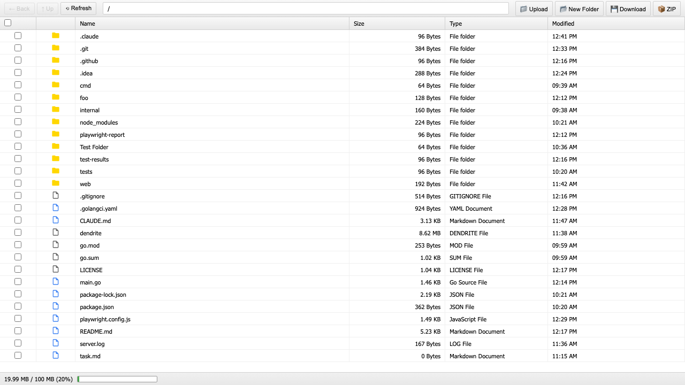

# Dendrite File Manager

[](https://github.com/dimedis-gmbh/dendrite/actions/workflows/ci.yml)
[](https://opensource.org/licenses/MIT)

Dendrite is a web-based file manager written in Go that allows managing remote file systems from a browser. It provides a Windows Explorer-like interface with comprehensive file management capabilities.



## Features

- 🗂️ **Windows Explorer-like Interface**: Familiar UI with file browsing, selection, and navigation
- 📁 **Complete File Operations**: Upload, download, move, copy, paste, delete, and create folders
- 🎯 **Drag & Drop Support**: Upload files and move items with drag and drop
- 📦 **ZIP Downloads**: Download multiple files or folders as a ZIP archive
- 💾 **Quota Management**: Set storage limits with user-friendly error messages
- ⌨️ **Keyboard Shortcuts**: Ctrl/Cmd+X/C/V for cut/copy/paste, Delete, F5 for refresh
- 🔗 **Clean URLs**: Navigate with clean path-based URLs (e.g., `/folder/subfolder`)
- 🚀 **Single Binary**: Easy deployment with embedded frontend assets
- 🔒 **Security**: Path traversal protection and secure file operations

## Installation

### Download Pre-built Binary

Download the latest release for your platform from the [releases page](https://github.com/dimedis-gmbh/dendrite/releases).

### Build from Source

Requirements:
- Go 1.21 or later
- Node.js 20 or later (for running tests)

```bash
git clone https://github.com/dimedis-gmbh/dendrite.git
cd dendrite
go build -o dendrite .
```

## Usage

### Basic Usage

```bash
./dendrite
```

This starts the server on `http://127.0.0.1:3000` serving the current directory.

### Command Line Options

```bash
./dendrite [options]
```

Options:
- `--listen`: IP address and port to listen on (default: `127.0.0.1:3000`)
- `--dir`: Directory to expose for web management (default: `./`)
- `--quota`: Maximum directory size with units (MB/GB/TB, default: no limit)

### Examples

```bash
# Serve /home/user/documents on port 8080
./dendrite --listen 0.0.0.0:8080 --dir /home/user/documents

# Set a 10GB quota limit
./dendrite --dir /var/data --quota 10GB

# Multiple options
./dendrite --listen 192.168.1.100:3000 --dir /shared --quota 500MB
```

## Keyboard Shortcuts

- **Ctrl/Cmd+A**: Select all files
- **Ctrl/Cmd+X**: Cut selected files
- **Ctrl/Cmd+C**: Copy selected files
- **Ctrl/Cmd+V**: Paste files
- **Delete**: Delete selected files
- **F5**: Refresh file list
- **Escape**: Clear selection and close dialogs

## Development

### Project Structure

```
dendrite/
├── main.go                 # Application entry point
├── internal/
│   ├── config/            # Configuration management
│   ├── filesystem/        # File operations and quota management
│   └── server/            # HTTP server and API handlers
├── web/                   # Frontend assets
│   ├── index.html
│   ├── css/
│   └── js/
└── tests/
    └── e2e/              # Playwright E2E tests
```

### Running Tests

```bash
# Run Go unit tests
go test ./...

# Run E2E tests (requires the server to be running)
npm test

# Run linter
golangci-lint run
```

### Test Coverage

The project maintains a minimum of 70% test coverage. Run coverage report:

```bash
go test -cover ./...
```

## Architecture

### Backend
- Written in Go using the standard library and Gorilla Mux for routing
- RESTful API design
- File operations with quota enforcement
- Path traversal protection
- Embedded frontend assets using `go:embed`

### Frontend
- Vanilla JavaScript (no framework dependencies)
- Windows Explorer-like interface
- Real-time quota display
- Browser history integration
- No external CDN dependencies (GDPR compliant)

## API Endpoints

- `GET /api/files?path=<path>` - List files in directory
- `POST /api/files` - Upload file
- `GET /api/files/<path>` - Download file
- `DELETE /api/files/<path>` - Delete file or directory
- `POST /api/files/<path>/move` - Move file or directory
- `POST /api/files/<path>/copy` - Copy file or directory
- `GET /api/files/<path>/stat` - Get file statistics
- `POST /api/mkdir` - Create directory
- `POST /api/download/zip` - Download multiple files as ZIP
- `GET /api/quota` - Get quota information

## Security Considerations

- Designed to run behind a reverse proxy for authentication and TLS
- Path traversal protection ensures access only within the configured directory
- File permissions follow secure defaults (directories: 0750, files: 0640)
- No built-in authentication - rely on reverse proxy or network isolation

## Contributing

1. Fork the repository
2. Create your feature branch (`git checkout -b feature/amazing-feature`)
3. Commit your changes (`git commit -m 'Add some amazing feature'`)
4. Push to the branch (`git push origin feature/amazing-feature`)
5. Open a Pull Request

Please ensure:
- All tests pass
- Code passes `golangci-lint`
- Test coverage remains above 70%
- New features include appropriate tests

## License

This project is licensed under the MIT License - see the [LICENSE](LICENSE) file for details.

## Acknowledgments

- Built with Go and vanilla JavaScript
- UI inspired by Windows Explorer
- Tested with Playwright