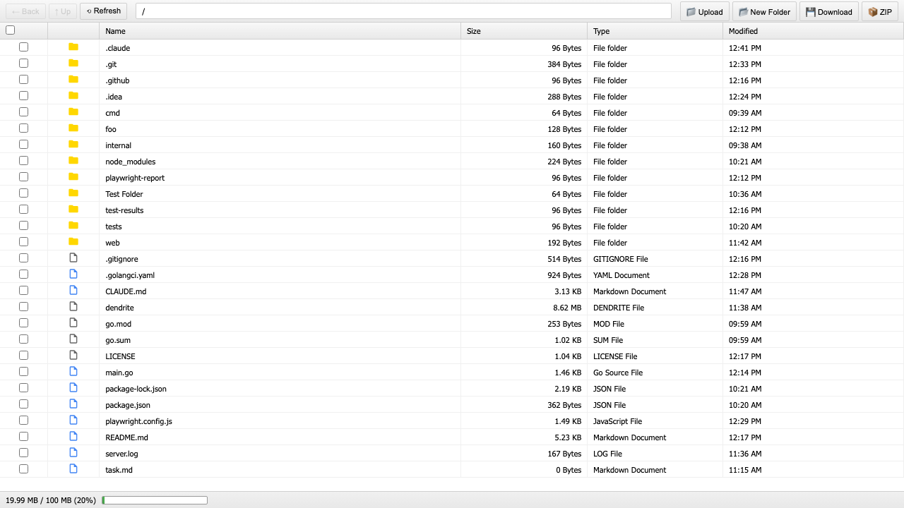

# Dendrite File Manager

[](https://github.com/dimedis-gmbh/dendrite/actions/workflows/ci.yml)
[](https://opensource.org/licenses/MIT)

Dendrite is a web-based file manager written in Go that allows managing remote file systems from a browser. It provides a Windows Explorer-like interface with comprehensive file management capabilities.



## Features

- 🗂️ **Windows Explorer-like Interface**: Familiar UI with file browsing, selection, and navigation
- 📁 **Complete File Operations**: Upload, download, move, copy, paste, delete, and create folders
- ✏️ **Built-in Text Editor**: Edit text files directly in the browser with syntax highlighting support
- 🖼️ **Built-in Image Editor**: Edit images with cropping, resizing, filters, and annotations
- 🎯 **Drag & Drop Support**: Upload files and move items with drag and drop
- 📦 **ZIP Downloads**: Download multiple files or folders as a ZIP archive
- 💾 **Quota Management**: Set storage limits with user-friendly error messages
- ⌨️ **Keyboard Shortcuts**: Ctrl/Cmd+X/C/V for cut/copy/paste, Delete, F5 for refresh
- 🔗 **Clean URLs**: Navigate with clean path-based URLs (e.g., `/folder/subfolder`)
- 🚀 **Single Binary**: Easy deployment with embedded frontend assets
- 🔒 **Security**: Path traversal protection and secure file operations
- 🔐 **JWT Authentication**: Optional JWT-based authentication with directory restrictions

## Installation

### Download Pre-built Binary

Download the latest release for your platform from the [releases page](https://github.com/dimedis-gmbh/dendrite/releases).

### Build from Source

Requirements:
- Go 1.21 or later
- Node.js 20 or later (for running tests)

```bash
git clone https://github.com/dimedis-gmbh/dendrite.git
cd dendrite
go build -o dendrite .
```

## Usage

### Basic Usage

```bash
./dendrite
```

This starts the server on `http://127.0.0.1:3000` serving the current directory.

### Command Line Options

```bash
./dendrite [options]
```

Options:
- `--listen`: IP address and port to listen on (default: `127.0.0.1:3000`)
- `--dir`: Directory to serve (can be specified multiple times, format: `source:virtual` or just `path`)
- `--config`: Path to TOML configuration file
- `--quota`: Maximum directory size with units (MB/GB/TB, default: no limit)
- `--jwt-secret`: JWT secret for authentication (minimum 32 characters)
- `--base-dir`: Base directory for JWT mode (required when using --jwt-secret)

### Examples

```bash
# Serve current directory
./dendrite --dir .

# Serve a specific directory
./dendrite --dir /var/www

# Serve multiple directories with virtual paths
./dendrite --dir /home/user/docs:/documents --dir /var/shared:/shared

# Set custom port and quota
./dendrite --dir . --listen 0.0.0.0:8080 --quota 10GB

# Use a configuration file
./dendrite --config dendrite.toml

# Override config file settings
./dendrite --config dendrite.toml --listen 0.0.0.0:8080

# Enable JWT authentication with base directory
./dendrite --jwt-secret "your-secret-key-at-least-32-characters-long" --base-dir /var/files
```

### Configuration File

Dendrite supports TOML configuration files for managing multiple directories. Create a `dendrite.toml` file:

```toml
[main]
listen = "127.0.0.1:3000"
quota = "100GB"

# For directory mode (without JWT)
[[directories]]
source = "/home/user/documents"
virtual = "/documents"

[[directories]]
source = "/var/shared/media"
virtual = "/media"

[[directories]]
source = "/opt/backups"
virtual = "/backups"

# For JWT mode (directories configuration is ignored)
[jwt_auth]
jwt_secret = ""  # Set to enable JWT authentication
base_dir = "/var/files"  # Base directory for JWT paths
```

With this configuration:
- **Directory mode**: Users will see three virtual directories (`/documents`, `/media`, `/backups`) that map to different physical locations on the server.
- **JWT mode**: When `jwt_secret` is set, the `directories` configuration is ignored. All paths in JWT tokens are relative to `base_dir`.

### Configuration Precedence

Configuration values are loaded in the following order (later values override earlier ones):
1. Configuration file (dendrite.toml)
2. Environment variables (e.g., `DENDRITE_LISTEN`, `DENDRITE_QUOTA`)
3. Command line arguments

### Environment Variables

All configuration options can be set via environment variables:
- `DENDRITE_LISTEN`
- `DENDRITE_DIR` (comma-separated for multiple directories)
- `DENDRITE_QUOTA`
- `DENDRITE_JWT_SECRET`
- `DENDRITE_BASE_DIR`
- `DENDRITE_CONFIG`

### JWT Authentication

When JWT authentication is enabled, Dendrite operates in a secure multi-tenant mode where:

- All directory paths in JWT tokens are relative to a configured base directory
- Each user can only access directories specified in their JWT token
- Users can have individual quota limits
- Sessions have configurable expiry times
- **Important**: JWT mode and directory configuration are mutually exclusive

To use JWT authentication:

1. Enable JWT with a base directory via configuration or command line:
   ```bash
   ./dendrite --jwt-secret "your-secret-key-at-least-32-characters-long" --base-dir /var/files
   ```

2. Create a JWT token with the following claims:
   ```json
   {
     "directories": [
       {
         "source": "user123/documents",
         "virtual": "/documents"
       },
       {
         "source": "shared/public",
         "virtual": "/public"
       }
     ],
     "quota": "100MB",
     "expires": "2025-12-31T23:59:59Z"
   }
   ```
   - `directories`: Array of directory mappings (paths are relative to base_dir)
   - `quota`: Sets a user-specific quota limit
   - `expires`: Controls when the session expires
   
   **Example**: With `--base-dir /var/files`, the path `user123/documents` maps to `/var/files/user123/documents`
   
   You can create test tokens using [jwt.io](https://jwt.io) - paste your secret in the signature section and the claims in the payload.

3. Access Dendrite with the JWT token in the URL hash:
   ```
   https://example.com/dendrite/#<jwt-token>
   ```

The JWT token is passed as a URL hash fragment for security - it won't be sent to the server or appear in logs.

#### Testing with curl

Once authenticated, you can test API endpoints:
```bash
# Set your JWT token
JWT="your-jwt-token-here"

# List files
curl -H "Authorization: Bearer $JWT" http://localhost:3000/api/files

# Get quota info
curl -H "Authorization: Bearer $JWT" http://localhost:3000/api/quota
```

## Built-in Text Editor

Dendrite includes a powerful built-in text editor for editing files directly in the browser:

### Opening Files in the Editor

There are multiple ways to open files in the editor:

1. **Double-click**: Double-click any editable file to open it in a new window
2. **Right-click menu**: Right-click and choose:
   - "Edit in modal" - Opens the editor in a modal overlay
   - "Edit in new window" - Opens the editor in a new browser window

### Editor Features

- **Syntax highlighting**: Automatic language detection for common file types
- **Line numbers**: Visual line numbering with synchronized scrolling
- **Desktop-like menus**: Familiar File and Edit menus that open on click (not hover)
- **Undo/Redo**: Full undo and redo support
- **Find & Replace**: Search and replace functionality
- **Status bar**: Shows file name, modification status, and cursor position
- **Smart warnings**: Context-aware unsaved changes warnings for modal vs window mode
- **Minimal chrome**: New windows open with minimal browser UI for distraction-free editing
- **Text selection preservation**: Selected text remains highlighted when using menus

### Supported File Types

The editor can open any text-based file, including:
- Text files (.txt, .md, .log)
- Source code (.js, .ts, .jsx, .tsx, .py, .go, .java, .c, .cpp, .rs, .rb, .php)
- Configuration files (.json, .xml, .yml, .yaml, .toml, .ini, .env)
- Web files (.html, .css, .scss, .sass, .less)
- Scripts (.sh, .bash, .zsh, .ps1, .bat)
- Documentation (.md, .rst, .tex)

### Editor Keyboard Shortcuts

- **Ctrl/Cmd+S**: Save file
- **Ctrl/Cmd+Z**: Undo
- **Ctrl/Cmd+Y**: Redo (Ctrl/Cmd+Shift+Z on Mac)
- **Ctrl/Cmd+X**: Cut selected text
- **Ctrl/Cmd+C**: Copy selected text
- **Ctrl/Cmd+V**: Paste
- **Ctrl/Cmd+A**: Select all
- **Ctrl/Cmd+F**: Find
- **Ctrl/Cmd+H**: Replace
- **Escape**: Close modal editor (with confirmation if unsaved)

## Built-in Image Editor

Dendrite includes a powerful built-in image editor powered by TUI Image Editor for editing images directly in the browser:

### Opening Images in the Editor

There are multiple ways to open images in the editor:

1. **Double-click**: Double-click any image file (.png, .jpg, .jpeg, .gif, .bmp, .webp) to open it in a new window
2. **Right-click menu**: Right-click and choose:
   - "Edit Image (modal)" - Opens the editor in a modal overlay
   - "Edit Image (new window)" - Opens the editor in a new browser window

### Image Editor Features

- **Cropping**: Select and crop areas with aspect ratio options
- **Resizing**: Change image dimensions while maintaining aspect ratio
- **Rotation**: Rotate images in 90-degree increments or free rotation
- **Flip**: Flip images horizontally or vertically
- **Drawing**: Freehand drawing with brush size and color options
- **Shapes**: Add rectangles, circles, triangles, and other shapes
- **Text**: Add text annotations with font and color customization
- **Icons**: Insert pre-defined icons and symbols
- **Filters**: Apply filters like grayscale, sepia, blur, sharpen, emboss, and more
- **Adjustments**: Fine-tune brightness, contrast, saturation, and other properties
- **Undo/Redo**: Full history support for all operations
- **Save**: Save edited images back to the server

### Supported Image Formats

The image editor supports the following formats:
- PNG (.png)
- JPEG (.jpg, .jpeg)
- GIF (.gif)
- BMP (.bmp)
- WebP (.webp)

### Image Editor Keyboard Shortcuts

- **Ctrl/Cmd+S**: Save image
- **Ctrl/Cmd+Z**: Undo last action
- **Ctrl/Cmd+Y**: Redo action (Ctrl/Cmd+Shift+Z on Mac)
- **Delete**: Delete selected object
- **Escape**: Deselect object or close modal editor

## Log Viewer

Dendrite includes a specialized log viewer for viewing and monitoring log files (.log) directly in the browser:

### Opening Log Files

- **Double-click**: Double-click any .log file to open it in a new window
- **Right-click menu**: Right-click and choose "View Log (window)" to open in a new browser window

### Log Viewer Features

- **Tail-like display**: Shows the last N lines of the log file (default: 150)
- **Real-time following**: Enable "Follow" mode to monitor log files in real-time via WebSocket
- **Search and filter**: Filter log entries with text search or regular expressions
- **Case-sensitive search**: Toggle case-sensitive matching for precise filtering
- **Soft-wrap**: Toggle line wrapping for better readability of long lines
- **Auto-scroll**: Automatically scrolls to bottom when new content arrives in follow mode
- **Connection status**: Visual indicator shows WebSocket connection status
- **Line counter**: Displays the current number of lines shown

### Log Viewer Controls

- **Search**: Enter text to filter log entries (press Enter to apply)
- **Case-sensitive (Aa)**: Toggle case-sensitive search
- **Regex (.*) **: Toggle regular expression mode for advanced pattern matching
- **Show last N lines**: Adjust how many lines to display (default: 150)
- **Reload**: Refresh the log content
- **Soft-wrap**: Toggle line wrapping
- **Follow**: Enable real-time log monitoring

### Important Notes

- Filtering happens **before** the line limit is applied, so "Last 150 lines" means the last 150 lines of filtered results
- In follow mode, the viewer clears existing content and only shows new lines
- Follow mode can be stopped by unchecking the Follow checkbox or pressing Escape
- Only files with .log extension can be viewed in the log viewer

## Keyboard Shortcuts

### File Manager Shortcuts

- **Ctrl/Cmd+A**: Select all files
- **Ctrl/Cmd+X**: Cut selected files
- **Ctrl/Cmd+C**: Copy selected files
- **Ctrl/Cmd+V**: Paste files
- **Delete**: Delete selected files
- **F5**: Refresh file list
- **Escape**: Clear selection and close dialogs

## Development

### Project Structure

```
dendrite/
├── main.go                 # Application entry point
├── internal/
│   ├── config/            # Configuration management
│   ├── filesystem/        # File operations and quota management
│   └── server/            # HTTP server and API handlers
├── web/                   # Frontend assets
│   ├── index.html
│   ├── css/
│   └── js/
└── tests/
    └── e2e/              # Playwright E2E tests
```

### Running Tests

#### Backend Tests

```bash
# Run Go unit tests
go test ./...

# Run with verbose output
go test -v ./...

# Run with race detection
go test -race ./...

# Run linter
golangci-lint run
```

#### Frontend E2E Tests

The frontend tests use Playwright and automatically set up an isolated test environment with a temporary directory and test files.

```bash
# Install dependencies first
npm install

# Run all tests in headless mode (default)
npm test

# Run tests with UI visible
npm test -- --headed

# Run tests in a specific browser
npm test -- --project=chromium
npm test -- --project=firefox
npm test -- --project=webkit

# Run tests with UI visible in a specific browser
npm test -- --headed --project=chromium
npm test -- --headed --project=firefox
npm test -- --headed --project=webkit

# Run a specific test file
npm test tests/e2e/file-manager.spec.js

# Run tests matching a pattern
npm test -- -g "should copy and paste"

# Run tests with debugging UI
npm test -- --ui

# Generate and open HTML report
npm test -- --reporter=html
npx playwright show-report

# Run tests in debug mode
npm test -- --debug
```

##### Testing for CI Compatibility

To ensure your changes work in CI before pushing:

```bash
# Check if port 3001 is available (CI requirement)
npm run test:ci

# Kill any dendrite processes and run tests
npm run test:local

# Simulate the exact CI environment locally (without Docker)
./test-ci-locally.sh

# Or use Docker for complete CI environment simulation
./docker-ci-test.sh
```

The tests automatically:
- Create a temporary test directory with sample files
- Start dendrite server pointing to this directory
- Run all tests
- Clean up the test environment after completion

**Important**: Always run `npm run test:ci` before pushing to ensure tests will pass in GitHub Actions.

##### E2E Test Helper Scripts

The following helper scripts in `tests/e2e/` support the testing infrastructure:

- **`check-port.js`**: Verifies port 3001 is available before running tests
  ```bash
  node tests/e2e/check-port.js
  ```
  
- **`cleanup-processes.js`**: Cleans up any lingering dendrite processes
  ```bash
  node tests/e2e/cleanup-processes.js
  ```
  
- **`test-setup.js`**: Manages the test environment lifecycle
  - Creates temporary test directories
  - Starts/stops dendrite server
  - Handles process cleanup
  
- **`global-setup.js`** & **`global-teardown.js`**: Playwright hooks for test initialization

### Test Coverage

The project maintains a minimum of 70% test coverage. Run coverage report:

```bash
go test -cover ./...
```

### Testing with Docker

While the CI pipeline now uses native GitHub Actions for Playwright tests, Docker-based testing is still available for complete environment simulation:

#### 1. Full CI Environment Simulation (`docker-ci-test.sh`)

This script reproduces a complete testing environment locally using Docker:

```bash
./docker-ci-test.sh
```

What it does:
- Builds a Docker image with Ubuntu, Go, Node.js, and Playwright
- Runs all tests in an isolated environment
- Useful for debugging platform-specific issues
- Note: The actual CI uses native Playwright action, not Docker

#### 2. CI Simulation Without Docker (`test-ci-locally.sh`)

This script simulates CI behavior without Docker:

```bash
./test-ci-locally.sh
```

What it does:
- Builds the dendrite binary
- Installs npm dependencies and Playwright Chromium
- Runs Go tests with race detection
- Runs Playwright tests with Chromium only (like in CI)
- Generates HTML test report

#### 3. Linter Testing (`test-golangci-lint.sh`)

Tests the Go linter in isolation:

```bash
./test-golangci-lint.sh
```

What it does:
- Runs golangci-lint v2.3.0 in a Docker container
- Tests on both AMD64 and ARM64 architectures
- Ensures linter configuration is valid across platforms
- Matches the exact linter version used in CI
- Detects architecture-specific code issues

#### 4. CI Linter Testing (`test-ci-lint.sh`)

Tests the linter with full CI environment variables:

```bash
./test-ci-lint.sh
```

What it does:
- Creates a temporary copy of the project
- Sets CI environment variables
- Runs linter as GitHub Actions would
- Ensures no environment-specific linter issues

### Docker Testing Prerequisites

Ensure Docker is installed and running:

```bash
docker --version  # Should show Docker version
```

### When to Use These Scripts

- **Before pushing**: Run `./docker-ci-test.sh` to ensure CI will pass
- **Debugging CI failures**: Use `./.github/test-ci-locally.sh` to reproduce issues
- **After linter config changes**: Run `./test-golangci-lint.sh`
- **For complete validation**: Run all scripts before major changes

### Docker Configuration

The project includes `Dockerfile.ci` which creates an environment identical to GitHub Actions:

```dockerfile
# Key features:
- Ubuntu latest (matching GitHub Actions)
- Go 1.23 with architecture detection (ARM64/AMD64)
- Node.js 20 for frontend tests
- Playwright with all browser dependencies
- Automatic binary compilation for the container architecture
```

This ensures tests run in the same environment locally as in CI, preventing "works on my machine" issues.

## Architecture

### Backend
- Written in Go using the standard library and Gorilla Mux for routing
- RESTful API design
- File operations with quota enforcement
- Path traversal protection
- Embedded frontend assets using `go:embed`

### Frontend
- Vanilla JavaScript (no framework dependencies)
- Windows Explorer-like interface
- Real-time quota display
- Browser history integration
- No external CDN dependencies (GDPR compliant)

## API Endpoints

### File Management
- `GET /api/files?path=<path>` - List files in directory
- `POST /api/files` - Upload file
- `GET /api/files/<path>` - Download file
- `DELETE /api/files/<path>` - Delete file or directory
- `POST /api/files/<path>/move` - Move file or directory
- `POST /api/files/<path>/copy` - Copy file or directory
- `GET /api/files/<path>/stat` - Get file statistics
- `POST /api/mkdir` - Create directory
- `POST /api/download/zip` - Download multiple files as ZIP
- `GET /api/quota` - Get quota information

### Text Editor
- `GET /api/files/<path>/raw` - Get raw file content for editing
- `PUT /api/files/<path>/raw` - Save edited file content

## Security Considerations

- Designed to run behind a reverse proxy for authentication and TLS
- Path traversal protection ensures access only within the configured directory
- File permissions follow secure defaults (directories: 0750, files: 0640)
- JWT mode provides additional security:
  - All paths are sandboxed within the base directory
  - Invalid JWT tokens never fall back to default directories
  - Directory existence is validated on each request
  - Paths that escape the base directory are rejected
- Without JWT: rely on reverse proxy or network isolation for authentication

## Contributing

1. Fork the repository
2. Create your feature branch (`git checkout -b feature/amazing-feature`)
3. Commit your changes (`git commit -m 'Add some amazing feature'`)
4. Push to the branch (`git push origin feature/amazing-feature`)
5. Open a Pull Request

Please ensure:
- All tests pass
- Code passes `golangci-lint`
- Test coverage remains above 70%
- New features include appropriate tests

## License

This project is licensed under the MIT License - see the [LICENSE](LICENSE) file for details.

## Acknowledgments

- Built with Go and vanilla JavaScript
- UI inspired by Windows Explorer
- Tested with Playwright